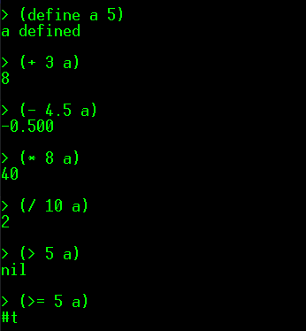

# Scheme Interpreter
An interpreter for simplified [Scheme programming language](https://en.wikipedia.org/wiki/Scheme_(programming_language))  

# License
This project is under the [MIT License](./LICENSE).
